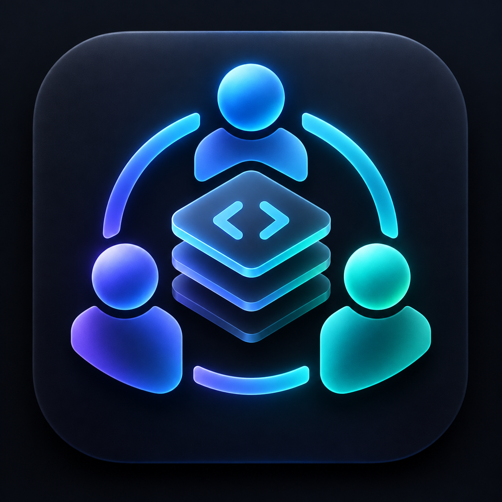
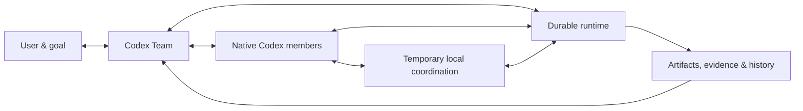

# Codex Team



**Delegate the goal. Let the team organize the work.**

[English](README.md) · [简体中文](README.zh-CN.md) · [Install & use](docs/usage.md) · [Architecture](docs/architecture.md)

[](https://github.com/DrPei12/codex-team/releases)
[](https://github.com/DrPei12/codex-team/actions/workflows/ci.yml)

Codex Team is a Codex plugin that takes a goal from conversation to verified delivery. It develops an understanding of the assignment, investigates missing information, proposes how to organize the work, and coordinates native Codex sessions as the work evolves.

Team is the plugin's single entrypoint. Describe the goal, discuss its direction, inspect progress, pause or continue, and receive the result through the same conversation. Planning, execution, coordination, recovery and verification are capabilities Team applies as the assignment develops.

You stay involved in the goal, the important tradeoffs, and the result. Team handles the coordination: who needs which context, what can proceed, when help is useful, what changed, and whether an outcome is ready to use.

## Start in Codex

Install the plugin from this repository:

```sh
codex plugin marketplace add DrPei12/codex-team
codex plugin add codex-team@codex-team-local
```

Open a new Codex task, select **Team** from the skill picker, and describe the outcome:

> $team I want a small tool that turns my reading notes into a searchable catalog. Help me shape the idea, build it, and verify the complete workflow.

Or bring a research or planning assignment:

> $team Compare three approaches to preserving a personal research library. Check primary sources and produce a recommendation I can act on.

Team develops the brief with you. It offers informed choices when they help, explains its own judgment, and uses the level of detail the assignment needs. Once the goal and execution authority are clear, it registers the work and starts the appropriate Codex sessions.

**Requirements:** Python 3.12 or later and an authenticated Codex CLI with App Server project support. Team uses your existing Codex login and the Python standard library. The core runs without third-party skills, plugins, or a separate model API key.

[Full installation, upgrades, controls, and recovery →](docs/usage.md)

## The idea

Working with several capable agents can turn the user into the team's message bus: forwarding answers, rebuilding context, deciding who should act next, and checking whether “done” means done.

Codex Team moves that organizing work into the product. Its vision is a team that can understand a broad delegation, form an effective organization for it, recognize when that organization needs to change, and carry responsibility through to delivery.

The division of labor can evolve. A member who investigates a problem may become its temporary local coordinator. It can organize the relevant work, review other members' results, and return that responsibility when the workstream is resolved. Member identity, current role, work item, and execution attempt remain separate.

## How it works

**Models make the judgments.** They understand the goal, research uncertain facts, choose methods, propose collaboration, revise the plan, and assess results. Conversation remains natural; there is no compulsory interview template or fixed roster of specialists.

**The runtime carries the commitments.** A bundled Python controller records work, messages, attempts, responsibility changes, and acceptance in SQLite. It dispatches actual Codex sessions, queues requests to busy members, checks dependencies, and preserves the state needed to continue after an interruption.



- **Adaptive organization.** Propose a better division, delegate a local scope, add or consolidate work, and hand responsibility back. Independent changes can proceed without invalidating unrelated work.
- **Readable collaboration.** Share findings as messages; send requests for action through the work queue. The user can inspect both the conversation and its effect on the plan.
- **Working notes + searchable history.** Keep the current understanding compact while retaining the original decisions, sources, failures, and artifacts. A replacement session can pick up the actual record.
- **Evidence-based delivery.** Submitting a result and accepting it are separate events. Acceptance binds the result to its content and criteria; only accepted dependencies unlock downstream work.
- **Recoverable execution.** Persist dispatch intent, track native execution, reconcile interrupted sessions, and retain workspace occupancy while execution is uncertain. External action records preserve the identity and observed outcome of an operation.
- **Control from Codex.** Ask Team for progress, inspect results and original records, pause work, or continue from the saved state.

[Read the architecture →](docs/architecture.md) · [Read the project definition →](docs/project-definition.md)

## Planned: project workspace

A future project board will bring together live member activity, readable agent conversations, assistance requests, progress and results. Project-level discussion and goal editing will carry context across sessions and show how each change affects execution.

## Build and contribute

The runtime uses the Python standard library. Development checks use `pytest`.

```sh
python -m pip install pytest
python -B scripts/check-release.py
```

The checked-in plugin under `plugins/codex-team` is a complete installable bundle. Source lives in `team_runtime`, `scripts`, and `skills`; `build-team-plugin.py` produces the bundle with a SHA-256 inventory. CI checks the runtime behavior, the single entrypoint, and package contents.

[Contributor guide](CONTRIBUTING.md) · [Release notes](CHANGELOG.md) · [Design decisions](docs/13-decisions.md)
