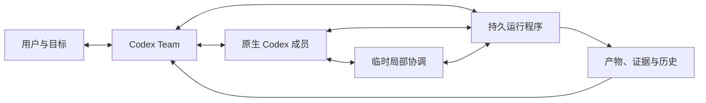

# Codex Team


**把目标交给 Team，让团队组织工作。**

[English](README.md) · [简体中文](README.zh-CN.md) · [安装与使用](docs/usage.zh-CN.md) · [运行原理](docs/architecture.zh-CN.md)

[](https://github.com/DrPei12/codex-team/releases)
[](https://github.com/DrPei12/codex-team/actions/workflows/ci.yml)

Codex Team 是一个从自然交流推进到成果交付的 Codex 插件。它理解委托、调查缺失信息、提出执行建议，并随着工作的展开组织与调整原生 Codex 会话之间的协作。

插件统一使用 Team 入口。提出目标、讨论方向、查看进展、暂停续接与接收成果，都通过自然对话进行。规划、执行、协调、恢复和核验由 Team 根据任务进展按需组织。

你参与目标、重要取舍和实际成果的判断。Team 承担组织工作：谁需要哪些背景、哪些工作可以继续、什么时候需要协助、发生了什么变化，以及成果是否已经可以采用。

## 从 Codex 开始

从本仓库安装插件：

```sh
codex plugin marketplace add DrPei12/codex-team
codex plugin add codex-team@codex-team-local
```

打开一个新的 Codex 任务，在技能选择器中选择 **Team**，描述你想完成的目标：

> $team 我想做一个小工具，把我的阅读笔记整理成可检索的目录。帮我完善想法、实现它，并验证完整使用流程。

也可以交给它研究或规划任务：

> $team 比较三种个人研究资料保存方案，核对一手来源，形成一份可以直接采取行动的建议。

Team 会与你逐步形成目标说明。它在有帮助时提供带信息的选项，解释自己的判断，根据任务需要决定讨论深度。目标与执行授权清楚后，它登记工作并启动适合的 Codex 会话。

**环境要求：** Python 3.12 及以上，以及已登录、支持 App Server 项目接口的 Codex CLI。Team 使用现有 Codex 登录和 Python 标准库，核心无需第三方 Skill、插件或额外的模型 API Key。

[完整安装、升级、控制与恢复教程 →](docs/usage.zh-CN.md)

**使用 Team 时即可获得更新。** 从 2.1 起，Team 会检查已发布版本，在运行间隙自动安装兼容更新，并简短说明体验改善和新增能力。说“更新只通知我”或“关闭更新检查”，即可改变这一偏好。

## 项目愿景

使用多个高能力 Agent 时，用户经常承担团队之间的联络工作：转发答案、重新补充上下文、判断下一步由谁行动，以及检查“完成”是否真的满足目标。

Codex Team 将这些组织工作纳入产品。我们希望它能够理解广泛的委托，为目标形成有效的组织方式，发现何时需要调整分工，并把责任持续推进到交付。

具体分工可以变化。一个调查问题的成员，可以临时成为相关工作线的协调者，组织后续工作、核验其他成员的成果，并在问题解决后交还协调职责。成员身份、当前角色、工作事项和执行尝试分别记录。

## 运行原理

**模型负责判断。** 理解目标、调查不确定信息、选择方法、提出协作、调整计划和评价成果，都交给模型。交流保持自然，系统不预设每轮必须重复的问答模板或固定专家阵容。

**运行程序落实承诺。** 插件内置的 Python 控制程序使用 SQLite 保存工作、消息、执行尝试、职责变化与接收记录，派发真实 Codex 会话，把发给忙碌成员的请求排队，检查依赖，并保存中断后继续所需的状态。



- **自适应组织。** 建议更合适的分工，委托局部协调，增加或合并工作，并交还职责。互不影响的调整可以继续，无须让无关工作全部失效。
- **可读协作。** 发现以消息分享，需要对方行动的请求进入工作队列。用户可以查看交流内容及其对安排的影响。
- **工作笔记＋可检索历史。** 简洁保存当前理解，同时保留原始决定、来源、失败与产物。替换会话时，后继成员可以接续实际记录。
- **有依据的交付。** 提交成果与接收成果分别记录。接收绑定产物内容和验收依据，只有已接受的依赖才能解锁后续工作。
- **可恢复执行。** 持久保存派发意图、追踪原生执行、核对中断现场；执行状态不明时继续保留现场占用。外部动作记录保存操作身份和观察到的结果。
- **在 Codex 中掌握进展。** 让 Team 汇报进展、查看成果与原始记录、暂停工作，或从已保存状态继续。

[阅读运行原理 →](docs/architecture.zh-CN.md) · [阅读正式项目定义 →](docs/project-definition.zh-CN.md)

## 后续规划：项目工作空间

后续将加入项目看板，集中展示成员实时活动、可读的 Agent 交流、协助请求、进展和成果。项目级讨论与目标编辑将跨会话保留上下文，并展示每项修改对实际执行的影响。

## 构建与参与开发

运行程序使用 Python 标准库，开发检查使用 `pytest`。

```sh
python -m pip install pytest
python -B scripts/check-release.py
```

仓库中的 `plugins/codex-team` 是完整可安装包。源码位于 `team_runtime`、`scripts` 和 `skills`；`build-team-plugin.py` 生成带 SHA-256 清单的插件包。CI 检查运行行为、唯一入口和打包内容。

[贡献指南](CONTRIBUTING.zh-CN.md) · [版本说明](CHANGELOG.zh-CN.md) · [设计决策](docs/13-decisions.zh-CN.md)
