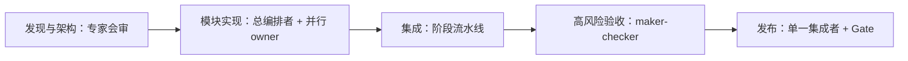

# 01. 概念模型

## 先纠正一个容易混淆的前提

“Worker”“同目录 fork”“worktree”“subagent”“阶段流水线”不是同一层级的选项，不能放进一张互斥列表里二选一。它们分别回答不同问题。

| 维度 | 回答的问题 | 例子 |
|---|---|---|
| 编排范式 | 多个执行者如何协作 | 总编排者并行分派、ABC 阶段流水线、maker-checker |
| 角色 | 这个执行者负责什么 | 架构师、模块 owner、实现者、验证者、集成者 |
| 执行身份 | 它是长期任务还是临时工具 | 用户可见 Codex 任务、任务内 subagent |
| 历史来源 | 它一开始知道什么 | 新建、从已有任务 fork、通过 handoff 接班 |
| Workspace | 它在哪里改文件 | 同一 checkout、独立 managed worktree、既有 permanent worktree、只读环境 |
| 生命周期 | 它存在多久 | 一次性、阶段性、长期保留、轮换后归档 |
| 模型配置 | 用多强的模型和 thinking | 高能力编排者、常规模块 worker、按风险升级 |

因此，一个实际 worker 可以被完整描述为：

> “支付模块 owner（角色），参与 contract-parallel（范式），是长期 Codex 任务（身份），从项目主任务 fork 获得背景（历史），在独立 managed worktree 修改（workspace），阶段结束后保留（生命周期），默认中档模型、遇到跨模块决策升级（模型策略）。”

## 三个平面

为了避免所有信息都挤在聊天消息里，系统分为三个平面。

### 控制平面

负责“谁在做什么、何时开始、遇到什么阻塞”：计划、依赖、任务状态、分配、取消、升级、等待和归档。主编排者是控制平面的 owner。

### 工作平面

负责实际修改：代码、文档、测试、构建、数据迁移、分支和 worktree。worker 在这里产生产物。

### 证据平面

负责证明工作结果：commit、diff 摘要、测试报告、日志摘要、环境指纹、覆盖范围、风险和 artifact hash。证据应可持久化并可被下一任务读取。

如果把证据平面省掉，主编排者只能选择盲信 worker 或重做全部工作；这正是重复验收问题的根源。

## 四种共享状态

多任务系统中需要明确区分：

1. **意图状态**：用户目标、约束和成功标准；由主任务维护并写入项目文档。
2. **计划状态**：任务图、owner、依赖、优先级和当前阶段；由控制平面维护。
3. **产品状态**：Git 中的代码、schema、配置和文档；以 revision 为事实锚点。
4. **运行证据**：测试、构建和审查的可复现结果；必须绑定到 revision 和环境。

聊天历史不是任何一种状态的唯一可靠存储。任务可以被归档或上下文被压缩，项目仍应能从仓库恢复。

## 默认组合不是固定范式

本项目的“默认混合架构”描述的是常驻角色和治理骨架，不强迫所有阶段使用同一种编排范式。一个项目可以这样变化：

常驻骨架决定“谁有最终责任、真相放在哪里、如何交接”；阶段范式决定“当前这批工作怎样流动”。二者互补，不冲突。

## 上限判断

多任务能力提高的是可管理工作的**宽度、隔离度和持续性**，不是无条件把单任务能力乘以任务数。实际上限取决于：任务可分解度、契约稳定度、集成成本、验证成本、模型能力、上下文质量和用户授予的自动化权限。项目必须用评测测出甜点区，而不能先假定“翻倍”。
