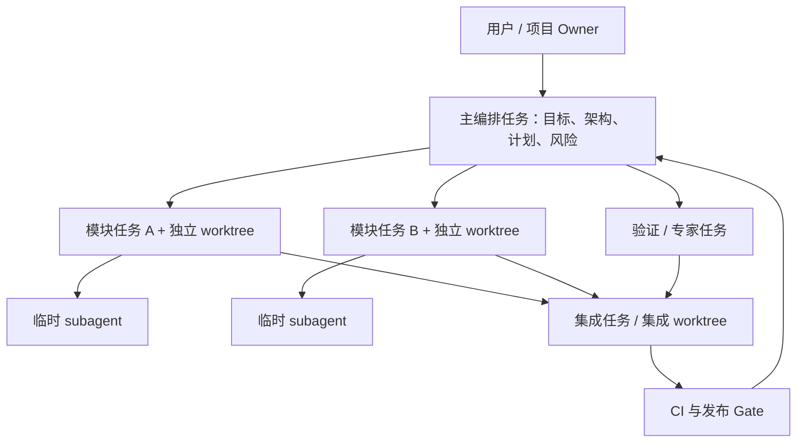

# 04. 默认运行架构

## 大白话版本

把它想成一支小型软件团队：

- **你**是项目 owner：决定做什么、什么风险可以接受、哪些不可逆动作能执行。
- **主任务**是项目经理兼总架构师：理解目标、拆工作、定接口、派任务、处理冲突、作最终判断。
- **长期 Codex 任务**是模块工程师：每个人有自己的历史和 worktree，持续负责一个领域。
- **Subagent**是工程师临时叫来的助手：查代码、读资料、跑一个局部分析、实现很小的单元，用完即收口。
- **集成任务**是负责合并和联调的人：按顺序接收已验收产物，不让所有模块 owner 一起修改集成现场。
- **CI / Gate**是自动质检：负责能机械证明的部分，不用聊天争论代替测试。

## 默认组织图

## 这套架构与编排范式的关系

组织图定义常驻责任，编排范式定义某一阶段如何流动。两者不冲突。

例如同一项目：

- 架构阶段用 expert council，让安全、数据和前端各自给方案；
- 开发阶段用 hub-and-spoke，主编排者给三个模块 owner 分配任务；
- 模块之间用 contract-parallel，先固定 schema 再同时实现；
- 集成阶段用 ABC pipeline，依次合并、联调、发布；
- 数据迁移点用 maker-checker，另一个任务独立批准。

所以“默认采用哪一种”不是全项目只选一个。默认骨架是主编排者中心制，默认开发流是契约先行的并行实现，默认集成流是单一集成者的串行接收，高风险处默认独立复核。

## 主编排者该做什么

- 维护项目目标、非目标和验收标准；
- 画出依赖图并判断哪些工作真正独立；
- 决定采用哪个范式和 workspace；
- 给每个 worker 写结构化 task brief；
- 管理 worker roster、等待、升级、取消和归档；
- 接收 artifact 引用和证据摘要；
- 判断证据是否可复用、是否需要补测；
- 控制集成顺序并向用户报告。

它不应默认承担所有源码搜索、所有实现、所有测试日志阅读，否则高能力模型的上下文会被低价值细节消耗。

## Worker briefing 的最低内容

1. 任务 ID 与目标；
2. 背景和用户价值；
3. 范围与明确非范围；
4. 所属 workspace、branch/worktree 和 base revision；
5. 文件或模块所有权；
6. 输入 contract / artifact；
7. 必须产出的 artifact；
8. 验收测试与证据格式；
9. 遇到哪些情况必须停止并升级；
10. 完成后向谁 handoff。

“极其详细的长 prompt”不是目标。目标是让关键约束结构化、无歧义、可引用；可从仓库读取的背景不重复塞进消息。

## 自动化边界

系统未来可以自动创建任务、选择隔离方式、派发、等待、收集证据、安排集成和归档。但下面这些默认需要明确政策或用户授权：

- 对共享主分支的最终合并；
- 推送、发布、部署和外部写操作；
- 数据删除、迁移和不可逆命令；
- 扩大任务范围或使用新凭据；
- 在证据冲突时跳过 Gate。

“全自动并行”是可追求的运行级别，不是无条件默认。系统成熟度应从建议模式、受控执行、自动集成，逐步提升到限定范围内的自治闭环。
