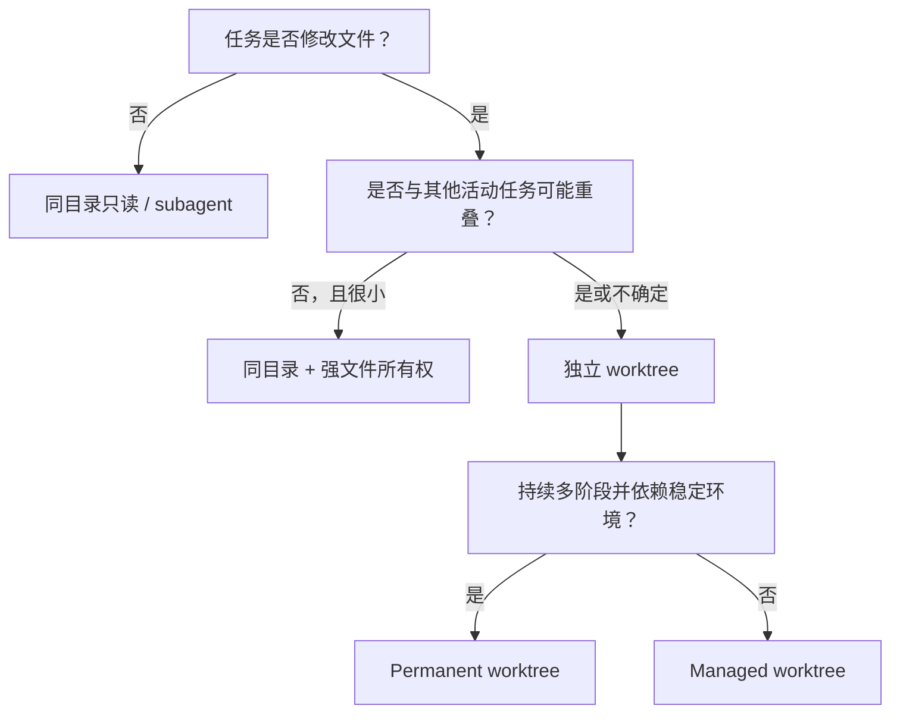

# 05. Codex 任务、Fork、Worktree 与 Handoff

## 术语提醒

Codex 界面常把独立会话称为 task；底层工具名可能使用 thread。本项目面向用户统一写“任务”，在涉及工具字段时保留 `threadId`。

## 当前可确认的能力

截至本项目建立时，Codex 桌面环境提供了围绕任务的创建、fork、列出、读取、等待、直接发送消息、handoff、固定、归档和重命名能力。Git 项目可以为任务使用 Codex 管理的 worktree，handoff 可在本地 checkout 与 managed worktree 之间转移任务和 Git 状态。

这些是当前产品能力的快照；具体参数、默认分支行为和 UI 表现仍应在实现 skills 时以当时官方文档和实际工具 schema 为准。

## Fork 到底复制什么

Fork 首先描述的是**会话历史分叉**：新任务从某个历史点继承背景，再独立继续。它不是 Git fork，也不天然等于新 branch。

需要分别确认两个问题：

1. 新任务继承了哪一段对话和指令？
2. 新任务绑定同一个 checkout，还是新/既有 worktree？

把两者简称为“同目录 fork”容易误导。本项目仍会保留这个大白话标签，但内部 worker card 必须分别记录 `history_origin` 和 `workspace_mode`。

## “同目录 fork”

大白话：两名知道相似背景的 Agent，同时坐在同一张桌子上改同一摞文件。

它很快，不用搬运代码，也没有后续 Git merge；但风险包括：

- A 尚未保存或测试完，B 已经读到中间状态；
- 一个任务改动另一个任务刚读过的文件；
- Git index、lockfile、生成目录或测试数据库互相干扰；
- 测试结果无法确定对应哪一个稳定 revision；
- 一方的回滚会覆盖另一方工作。

因此它只适合只读协作、明确不重叠文件，或主任务与短命 subagent 的受控局部操作。它不是大型并行开发的默认方式。

## Managed worktree

大白话：给每名 Agent 一套独立文件视图。它解决物理写冲突和未提交状态互相污染，但不解决：

- 两人修改同一逻辑产生的 merge conflict；
- 各自基于不同契约实现造成的语义冲突；
- 数据库、端口、远端服务等外部共享资源冲突；
- 依赖版本或生成物差异；
- 合并后才出现的集成失败。

因此 worktree 必须与文件所有权、契约版本、独立运行资源和集成 Gate 一起使用。

## Permanent worktree 与 managed worktree

- **Managed worktree**：Codex 为任务生命周期管理，适合临时或阶段性并行分支。
- **Permanent worktree**：项目长期维护，适合模块 owner、固定环境或持续集成分支。

前者管理负担小，后者稳定但需要项目自己清理、同步和处理分支占用。不能仅凭任务是否长期存在决定；依赖缓存、工具链、外部资源和团队习惯也会影响选择。

## Worker 与 worktree 的区别

Worker 是责任主体，worktree 是它使用的工作环境。一个 worker 可以换 worktree；一个 worktree 在责任移交后也可以换 owner。把两者绑定成同一个概念会导致无法表达只读 worker、集成 worker或 handoff。

## Handoff

Handoff 有两个同时发生但必须分别验证的层面：

1. **执行权转移**：新任务接替目标、约束、风险和未决工作；
2. **状态转移**：Git branch/worktree、未提交变更或特定 revision 被正确接管。

成功调用 handoff 工具只说明产品操作完成，不证明新任务理解了项目，也不证明磁盘状态正确。接收方应先读取交接 artifact、确认路径与 revision、检查工作区状态，再继续。

## 推荐 workspace 决策

## 尚未确认的产品细节

第一轮实现前要用官方文档与本地实验核验：

- fork 后 workspace 的所有可选组合和默认值；
- create task 在不同项目类型下的 branch/HEAD 行为；
- handoff 对未提交文件、submodule、LFS 和冲突状态的处理；
- 归档任务与 worktree 清理是否联动；
- 任务消息的大小、可靠投递、顺序和持久性保证；
- 活跃任务、等待和并发的实际限制。

在核验前，skills 必须 fail closed：不根据猜测自动删除 worktree、覆盖状态或合并分支。
