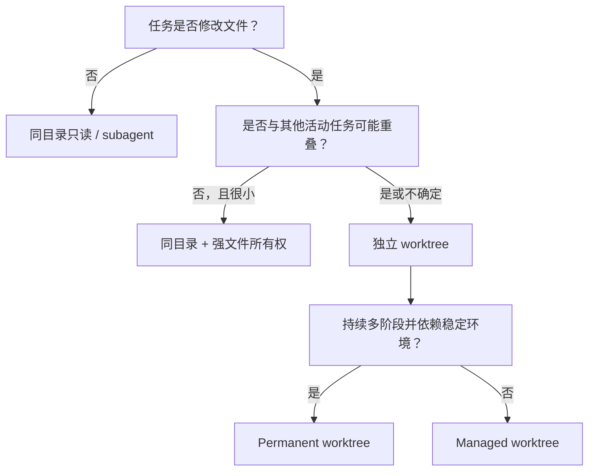

# 05. Codex 任务、Fork、Worktree 与 Handoff

## 术语提醒

Codex 界面常把独立会话称为 task；底层工具名可能使用 thread。本项目面向用户统一写“任务”，在涉及工具字段时保留 `threadId`。

## 当前可确认的声明面

2026-08-11 的本地静态 snapshot 是：

- Codex AppX：`OpenAI.Codex 26.803.10989.0`，Windows X64；
- Codex CLI：`codex-cli 0.146.0`；
- CLI feature flag：`multi_agent` 标为 `stable=true`，`multi_agent_v2` 标为 `stable=false`；
- 当前 Desktop tool schema 声明了任务创建、fork、列出、读取、等待、直接消息、handoff、固定、归档和重命名入口；Git project create 可以请求 managed worktree，handoff 声明可在 checkout 与 managed worktree 之间移动其他任务及其 Git 状态；
- 当前 session collaboration schema 声明了 subagent 的 spawn、follow-up、message、interrupt、list 和 wait 入口。

以上大部分仍只是**当前环境声明**，不是行为保证。当前行为观测已增加到：只读 list/read、两个 `codex exec -C` 手工 worktree 会话、一个 idle direct message/wait 回合，以及一个 idle same-directory fork。Desktop managed-worktree create/worktree fork、handoff、archive、subagent 和故障状态仍未确认。完整环境、claim、证据关系和 unknown 见 [Capability Contract](18-capability-contract.md)；实验结果见 [2026-08-12 pilot](research/capability-pilot-2026-08-12.md)。

Pilot 还证明 workspace 至少有三层边界：文件目录、Git 身份和 Codex 运行上下文。`-C` 与 worktree 解决前两层的一部分，但不会阻止全局 memory、skills、plugins 和用户配置加载。后续 workspace policy 必须同时记录三层，不能把“在独立目录”写成“完全隔离”。

## Desktop 是后续执行基准

从 D-023 起，用户可见 worker 的创建、fork、消息、等待和 handoff 都以 Codex Desktop 原生任务为准。Shell 只承担 Git 状态、测试、hash 和 artifact 等机械工作；`codex exec` 不再启动 worker，也不能用来“补齐”Desktop 实验。前述 CLI 观测保留为历史兼容性资料，不能证明 Desktop 当前行为。

路径约束已经部分解除：用户已把实验场内的 clean checkout `outputguard-single` 注册为 saved project，Desktop `local` 任务随后通过只读和 write/test qualification。Qualification 09 先证明固定 helper 可在 assigned permanent worktree 创建 marker commit；OutputGuard Run02–Run10 又观察到真实 implementer、recovery、integrator 和 reviewer task 能以 saved project 为控制入口，在 brief 指定的 permanent worktree 中产生功能 commit、artifact handoff、合并和只读 review，同时保持 hub checkout 不被写入。create/fork schema 仍不能把任意已有 worktree 直接设为 task cwd，所以这不是“产品入口直接绑定 worktree”或 Desktop-managed worktree 证据。每条真实任务仍必须先自证 Git common dir、branch、HEAD、ordinary/ignored state 与定向执行能力，父任务再独立复核。若该机制失败，`team-run` 停止，不改用 hub checkout、Desktop 默认 managed worktree 或 CLI。

## Fork 到底复制什么

Fork 首先描述的是**会话历史分叉**：新任务从某个历史点继承背景，再独立继续。它不是 Git fork，也不天然等于新 branch。

需要分别确认两个问题：

1. 新任务继承了哪一段对话和指令？
2. 新任务绑定同一个 checkout，还是新/既有 worktree？

把两者简称为“同目录 fork”容易误导。本项目仍会保留这个大白话标签，但内部 worker card 必须分别记录 `history_origin` 和 `workspace_mode`。

## “同目录 fork”

大白话：两名知道相似背景的 Agent，同时坐在同一张桌子上改同一摞文件。

它很快，不用搬运代码，也没有后续 Git merge；但风险包括：

- A 尚未保存或测试完，B 已经读到中间状态；
- 一个任务改动另一个任务刚读过的文件；
- Git index、lockfile、生成目录或测试数据库互相干扰；
- 测试结果无法确定对应哪一个稳定 revision；
- 一方的回滚会覆盖另一方工作。

因此它只适合只读协作、明确不重叠文件，或主任务与短命 subagent 的受控局部操作。它不是大型并行开发的默认方式。

## Managed worktree

大白话：给每名 Agent 一套独立文件视图。它解决物理写冲突和未提交状态互相污染，但不解决：

- 两人修改同一逻辑产生的 merge conflict；
- 各自基于不同契约实现造成的语义冲突；
- 数据库、端口、远端服务等外部共享资源冲突；
- 依赖版本或生成物差异；
- 合并后才出现的集成失败。

因此 worktree 必须与文件所有权、契约版本、独立运行资源和集成 Gate 一起使用。

## Permanent worktree 与 managed worktree

- **Managed worktree**：Codex 为任务生命周期管理，适合临时或阶段性并行分支。
- **Permanent worktree**：项目长期维护，适合模块 owner、固定环境或持续集成分支。

前者管理负担小，后者稳定但需要项目自己清理、同步和处理分支占用。不能仅凭任务是否长期存在决定；依赖缓存、工具链、外部资源和团队习惯也会影响选择。

## Worker 与 worktree 的区别

Worker 是责任主体，worktree 是它使用的工作环境。一个 worker 可以换 worktree；一个 worktree 在责任移交后也可以换 owner。把两者绑定成同一个概念会导致无法表达只读 worker、集成 worker或 handoff。

## Handoff

Handoff 有两个同时发生但必须分别验证的层面：

1. **执行权转移**：新任务接替目标、约束、风险和未决工作；
2. **状态转移**：Git branch/worktree、未提交变更或特定 revision 被正确接管。

成功调用 handoff 工具只说明产品操作完成，不证明新任务理解了项目，也不证明磁盘状态正确。接收方应先读取交接 artifact、确认路径与 revision、检查工作区状态，再继续。

## 推荐 workspace 决策

## 尚未确认的产品细节

第一轮实现前要用官方文档与本地实验核验：

- fork 后 workspace 的所有可选组合和默认值；
- create task 在不同项目类型下的 branch/HEAD 行为；
- handoff 对未提交文件、submodule、LFS 和冲突状态的处理；
- 归档任务与 worktree 清理是否联动；
- 任务消息的大小、可靠投递、顺序和持久性保证；
- 活跃任务、等待和并发的实际限制。

在核验前，skills 必须 fail closed：不根据猜测自动删除 worktree、覆盖状态或合并分支。

当前已创建多条符合 D-023 的 Desktop local 实验任务，并观察到 saved-project task 创建、只读身份核验、简单 Git index/ref 操作、public Gate、外置缓存、离线 build、assigned permanent worktree 的真实功能 commit、artifact-based handoff、integration 和 review。正式 `handoff_thread` 产品操作、Desktop-managed worktree、产品入口对任意既有 worktree 的正式 cwd 绑定、archive 和 subagent 仍未由本轮验证；这些组合继续保持 `declared_unverified` 或 `unknown`，按真实 workflow 需要逐项补最小 probe。

Run10 还补充了一个 Git 细节：普通 porcelain clean 不包含 ignored residue。sealed evaluator 子进程留下 29 个 ignored `.pyc`，而 commit/tree 和 ordinary status 都未变化。后续 preflight/finish 必须显式选择是否审计 `--ignored --untracked-files=all`，不能用单个 `clean=true` 覆盖不同边界。
