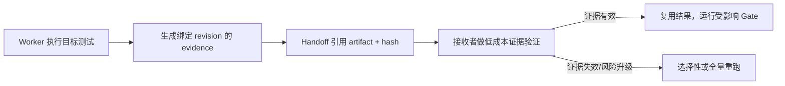

# 07. 交接与验收：避免把昂贵测试跑两遍

## 问题不是“要不要信任 B”

如果 B 跑了 30 分钟全量测试，A 收到消息后再无条件跑一遍，确实浪费约 30 分钟算力和等待时间；A 读取两份日志、轮询进度和分析重复失败还会增加 token。反过来，如果 A 只接受一句“tests pass”，又会把错误 revision、错误环境、漏测和伪阳性带入集成。

正确问题是：**什么证据足以让哪一层验收复用，什么变化会让证据失效？**

## Proof-carrying handoff

Worker 交付的不只是代码，而是“代码 + 可验证证据包”。接收者先验证证据身份和完整性，再决定是否补测。



## 分层验证

### L0：声明检查

只读 handoff 摘要。几乎无成本，但不能单独用于接收代码。

### L1：身份与完整性检查

确认 artifact hash、commit/tree、workspace、命令、exit code、时间和环境指纹匹配。可运行非常便宜的文件/manifest 校验。

### L2：便宜的目标 smoke

接收者运行秒级检查，验证测试入口、关键导入或最小行为，不重复 30 分钟 suite。

### L3：Affected / integration Gate

合并后只运行受影响模块、契约和集成测试。它验证的是 worker 环境无法证明的新事实：组合后的 revision。

### L4：全量 / release Gate

在发布候选、证据失效、高风险变更或规定时间点运行一次全量测试。多个 worker 的工作合并后共享这一轮，而不是每个接收者各跑一轮。

## 证据缓存键

一个测试结果至少绑定：

```text
source tree hash
+ test suite/version and selector
+ exact command
+ dependency lock hash
+ toolchain/environment fingerprint
+ required service/data fixture version
```

只有这些输入等价，结果才有资格复用。仅相同 commit 不够：外部数据库、生成器、编译器或 test suite 自己变化都会使证据过期。

## Canonical manifest 与 projection

OutputGuard Run05 和 Run08 说明，仅列出缓存键还不够：如果同一 hash 被人工抄进 plan、brief、preregistration 和 freeze，它们会互相漂移。当前接受规则是：一个 canonical run manifest 拥有所有重复 identity，角色文档只保存机器生成或经 validator 交叉验证的 projection。

聚合 diff、directory tree 或 cache digest 必须同时记录唯一的字节生成算法，包括命令、参数、path order、编码与换行。生产者和消费者“都算了一个 hash”不代表算的是同一对象。

task 创建前由 parent preflight 验证 manifest 与所有 projection；task 开始后由 worker preflight 在真实 workspace 验证自身 projection。两者均输出机器可读 receipt，不能用自由文本“看起来一致”替代。

## Proof-carrying recovery

恢复不是修改旧 handoff，而是新建 successor run。recovery brief 至少绑定：

1. predecessor run ID 与不可变 status；
2. exact candidate 的 commit/tree，或 dirty candidate 的文件 bytes/hash、Git blob/patch identity 和唯一生成算法；
3. 已经成立且仍有效的 proof；
4. 唯一尚未成立的新事实；
5. 允许运行的命令、次数、mutation 和预算；
6. stop rule 与历史不回写声明。

Run10 观察到这套方法可以复用 Run07 CLI commit 和 Run09 Core candidate，不重跑 Run09 RED；Integrator 完成完整 public Gate 后，父任务也只验证 evidence/Git/artifact identity，没有再跑一遍同一 Gate。这个结果只证明该 exact lineage 的复用成立，不是所有项目都可省略重跑的保证。

## Artifact root 与 cleanliness receipt

测试证据必须同时绑定输出目录前置条件。`--basetemp`、cache、dist 等嵌套路径的父目录由谁创建、初始应为空还是不存在、结束允许出现什么，都应在 task 创建前生成 receipt。Run09 正是因为文字约束与 pytest 实际目录要求冲突而停止。

最终 handoff 的 clean 也不能只有一个布尔值。至少分别记录：

- ordinary tracked/untracked porcelain；
- ignored 路径及其 exact inventory；
- merge/rebase/cherry-pick 等 Git operation residue；
- run-local artifact/cache/dist inventory；
- 是否执行 cleanup、由谁授权、是否可恢复。

Run10 sealed 后 ordinary status 为 clean，但 evaluator 子进程留下 29 个 ignored `.pyc`。因此产品 Gate 通过，同时 `residue_free_checkout` 被否定；两种事实都必须保留。

## 必须重跑的情况

- handoff 引用的 revision 与待合并/待发布 revision 不一致；
- 测试覆盖的代码或测试自身发生相关变化；
- 环境、lockfile、fixture 或外部依赖不匹配；
- artifact/hash 缺失、损坏或来源不可信；
- 测试被取消、存在未解释 skip/flaky/timeout；
- 多分支合并产生了 worker 未测试的新组合；
- 安全、数据迁移、发布政策规定必须独立复核；
- 失败成本高于重跑成本，且没有更强证明。

## 不应重跑的情况

- 接收者只是为了“表示认真”，没有指出新的待证明事实；
- 完整证据仍绑定同一 tree、suite 和环境；
- 后续工作只消费稳定 artifact，不触及其实现；
- 已有可信 CI 对完全相同缓存键给出不可变结果。

## 交接回复结构

Worker 回报应按这个顺序：

1. `Outcome`：完成/部分/阻塞，一句话；
2. `Revision and workspace`：准确定位代码状态；
3. `Contract changes`：是否改变公开接口；
4. `Artifacts`：handoff、diff/commit、test evidence、日志引用和 hash；
5. `Coverage`：测了什么、没有测什么；
6. `Risks`：已知风险、flaky、环境差异；
7. `Requested action`：接收方只需做什么；
8. `Rerun triggers`：何时证据失效。

主编排者的接收回复也要结构化：`ACCEPTED_FOR_INTEGRATION`、`NEEDS_EVIDENCE`、`REJECTED` 或 `SUPERSEDED`，并引用判定条件。

## 长任务的执行权归属

默认规则：最靠近变更、最了解目标测试的 worker 运行目标 suite；集成者运行合并后 affected/integration Gate；release owner 运行一次全量 Gate。若 CI 能产生可信不可变证据，优先由 CI 执行长测试，Agent 只提交、等待和解释结果。

## 防止“Agent 开会化”

- 不定时同步，只在状态转换、阻塞或契约变化时发消息；
- 不把日志粘进消息，只发摘要与 artifact；
- 不重复解释仓库里已有的 spec；
- 任务间不争论“感觉是否通过”，用 acceptance contract 和证据判定；
- 主编排者可批量等待多个任务，不轮询每句 commentary；
- 若契约未变化，worker 无需向所有相关任务广播，只通知直接消费者或更新共享状态。

## 已观察与尚需实测

OutputGuard recovery lineage 已观察到：exact identity 验证、affected/public Gate 分层、fresh review、单次 sealed authorization 和 append-only recovery 能在一个 Windows/Codex Desktop 案例中闭环。证据复用的正确率、测试选择算法、环境指纹粒度、flaky 处理、跨仓库泛化和重复可靠率仍需第二 benchmark 与多次对照；不能把一次观察写成通用缓存保证。
