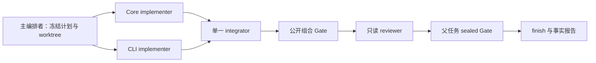

# 19. OutputGuard 首个 Desktop 纵向切片计划

> 状态：`executed — accepted through recovery lineage with limitations`  
> 冻结日期：2026-08-13；结果日期：2026-08-15  
> 适用范围：`OUTPUTGUARD-JSONL-STREAM-V1` 的第一轮 Codex Desktop 多任务运行

## 这轮到底要证明什么

这轮不是证明“多任务一定比单任务好”，也不是证明整套 skills 已经成熟。它只检验一个更窄、可证伪的问题：在固定仓库、固定公开契约和固定验收 Gate 下，主编排者能否把 Core 与 CLI 两块真正可分的工作交给独立 Codex Desktop 任务，在独立 Git worktree 中产出可核验的 commit 和 handoff，再由单一 integrator 合并、由独立 reviewer 检查，最后通过公开与 sealed Gate。

若任何 task 无法绑定自己的 worktree、越过文件所有权、缺少可定位证据、需要修改冻结 contract，或集成结果无法通过 Gate，本轮应停止或判失败，不能临时改题、改标准或退回 CLI。

## 执行结果与计划偏差

完整实录见 [2026-08-15 OutputGuard Desktop 纵向切片实录](research/outputguard-vertical-slice-2026-08-15.md)。最终 exact tree 通过公开 Gate、fresh Reviewer 和单次 sealed evaluator：full public suite 为 `2093 passed, 28 skipped`，sealed 为 `37 passed`。

这个结论来自 Run02–Run10 的 append-only recovery lineage，不是一个从零开始、四条新任务无中断通过的 run。最终 Run10 复用了 Run07 已验收的 CLI commit 和 Run09 冻结的 Core candidate，新建三条 Desktop task：Core recovery、Integrator、Reviewer。实际合并顺序是 CLI → Core，与本计划最初写的 Core → CLI 不同；Run10 在 task 创建前重新冻结了该顺序和 exact commits，合并无冲突且最终 blob 与 lane commit 一致。这个受控变更应视为 recovery plan 的显式偏差，不能反写成本计划从未改变。

执行同时暴露三个控制面要求：重复 identity 必须来自单一 canonical manifest；pytest/cache/build 的父 artifact root 必须先存在并验证；结束状态必须分别检查 ordinary 与 ignored 文件。相应决策见 D-027、D-028、D-029。

## 固定输入

| 输入 | 固定值 |
|---|---|
| 上游仓库 | `ndcorder/outputguard` |
| 上游 commit | `cfcdf871ae613f4a958f1880283f31aa87d5875d` |
| 公共 scaffold commit | `d235f59dcb7eb853043117402d3a1c8ef267b9af` |
| 公共 scaffold tree | `063ebf5b6cb7dca61d9ceb08bbf7d9dff54061a7` |
| Desktop saved project | `outputguard-single` / `082eff70-1f80-4421-bb5b-d896d12961ff` |
| 固定 Python | `D:\Desktop\Codex多任务工程系统实验场\candidate-envs\outputguard\Scripts\python.exe` |
| Python executable SHA-256 | `9648d84a822ffd73cc22013052c9dbc307c1bc56746239173b30eb5d7dfb56ef` |
| `pyvenv.cfg` SHA-256 | `cccde05ac0ae90b0d290a1b5a8c97c406199dda4671048b305eae6ae970e73ff` |
| task spec SHA-256 | `68112c2aab092fd39c04821caa33b02d337318ba3908fbd7ee946b0f2a9ea0c6` |
| contract SHA-256 | `6e6a32fe2c23263795780abd66ce54b10c51a277d137f500bbd4a1234b7c34a9` |
| worker handoff schema SHA-256 | `0bcddce4d79a938568dcf0c9f250469df2ba78bd3da86dcb243e3967bba20afb` |
| reviewer handoff schema SHA-256 | `c279ce1c1de348a45db2e11770b85c9c608e7bd1b6dd08f31f9c924deec78972` |
| evaluator manifest SHA-256 | `a6c1a7fbd1efa884ec26913a38af8099da1cebcb2d2af466741fcb91128cf733` |

公开材料只从实验场 `benchmarks/outputguard-jsonl-stream-v1/public/` 读取。worker、integrator 和 reviewer 不得列出或读取 `evaluator-vault`，不得联网查找 GitHub 实现，也不得读取旧 worker 的 dirty worktree、失败补丁或彼此未交付的工作目录。

## 已完成的实现前资格检查

资格证据可以按相同 checkout、HEAD 和解释器组合，但失败 run 的结论不能被事后改成 PASS：

| Run | 整体结论 | 可复用事实 | 不可复用部分 |
|---|---|---|---|
| Desktop preflight 01 | PASS（只读范围） | saved project、cwd、branch、HEAD、clean、无 bytecode 导入 | 写入、测试、commit 未测 |
| Qualification 01 | INVALID/BLOCKED | 无 | worker 在停止条件后自行改命令并继续 |
| Qualification 02 | BLOCKED | 简单 Git index/ref 写入、核验、删除与 clean | 系统 Python 缺 pytest |
| Qualification 03 | BLOCKED | 固定环境完整 pytest：`2048 passed, 28 skipped` | Ruff 参数位置错误，后续未跑 |
| Qualification 04 | BLOCKED | Ruff format/check、mypy 类型结果、Git diff 命令均 exit 0 | mypy 在仓库留下 `.mypy_cache` |
| Qualification 05 | PASS | 固定 mypy 命令 exit 0，19 个缓存文件只写入 run 目录，仓库保持 clean | 本 run 不覆盖 commit、package build 或 assigned worktree |
| Qualification 06 | BLOCKED | 原始 249-file build cache seed、checkout clean 与输入身份保持不变 | 父任务给出的 wrapper 与 tree digest 规范有歧义，build 未执行 |
| Qualification 07 | BLOCKED | 可移植 cache digest helper 与固定边界检查有效 | `uv` 服从 `.python-version=3.10`，本机无 3.10，build 在产物生成前失败 |
| Qualification 08 | PASS | 显式绑定 Python 3.12.1 的 `uv --offline --no-python-downloads` 生成一份 wheel 与一份 sdist；cache/dist 全在 run 目录，checkout clean | 未抓取网络包，产物未安装或 import |
| Qualification 09 | PASS（工具追踪有限） | 真实 Desktop local task 从 saved project 启动，在 assigned permanent worktree 留下唯一 marker commit；父任务复核 parent/path/hash/clean，hub 未变化 | Desktop task reader 未暴露底层 tool-call 明细；不证明自由执行时总会正确路由，也不证明 Desktop-managed worktree |

因此实现前 plumbing 条件已满足，可以建立真实 lane worktree 并启动 Core 与 CLI。资格运行只证明记录条件下的命令、路径和权限能力；不能把 marker commit 或 package 产物表述成功能、sealed tests、长期可靠性或多任务收益证据。

## 拓扑和 DAG

本轮使用 `hub-and-spoke + contract-parallel + single integrator + independent reviewer`。共享 contract 已在实现前冻结，不再设一个“讨论 contract”的 worker。

| Lane | Codex 身份 | 逻辑 workspace | 分支 | 写入权限 |
|---|---|---|---|---|
| Core | fresh Desktop task | `worktrees/outputguard-team-core-01` | `codex/outputguard-team-core-01` | 仅 Core ownership |
| CLI | fresh Desktop task | `worktrees/outputguard-team-cli-01` | `codex/outputguard-team-cli-01` | 仅 CLI ownership |
| Integrator | fresh Desktop task | `worktrees/outputguard-team-integrate-01` | `codex/outputguard-team-integrate-01` | 仅合并、冲突处理和集成所需修改 |
| Reviewer | fresh Desktop task | Integrator 完成后的同一 integration worktree | 同上，只读 | 禁止修改与 commit |

主编排者属于控制面，不计入 worker lane。四条用户可见任务满足首轮 3–5 条 session 的研究范围，但这个数量不是产品上限。

## Desktop project 与 worktree 的绑定规则

当前 Desktop 工具能对 saved project 创建 `local` task，却不能把任意已有 worktree 路径直接注册为 task cwd。为遵守实验根目录边界，本轮把两个概念分开记录：

- `task_project`：已注册且保持 clean 的 `outputguard-single`，只用于 Desktop 创建和任务归属；
- `execution_workspace`：任务 brief 指定的实验场内 permanent worktree，才是允许读写和提交的目录。

每个写入 task 必须先在自己的真实回合中证明：项目 checkout 与 assigned worktree 属于同一 Git common dir；assigned branch、HEAD、clean 与计划一致；hub checkout 仍 clean；任务能把所有命令和补丁精确指向 assigned worktree。主编排者随后独立复核。任一条件不成立立即停止，不在 hub checkout 试写，也不改用 Desktop-managed worktree 或 CLI。

Qualification 09 已在一条专用预检分支上确认该机制可行：task 的实际 cwd 是 clean `outputguard-single`，固定 helper 只在 assigned worktree 产生一个 marker commit，父任务复核后两边均 clean。真实 Core/CLI task 仍须逐条重复身份 preflight；该结果也不能外推为 Desktop-managed worktree、任意命令路由或长期可靠性已验证。

## 文件所有权

Core lane 只拥有：

- `outputguard/jsonl.py`
- `outputguard/__init__.py`
- `tests/test_jsonl.py`
- `docs/batch-processing.md`

CLI lane 只拥有：

- `outputguard/cli.py`
- `tests/test_jsonl_cli.py`
- `docs/cli.md`

任何其他路径、依赖文件、配置、已有测试或 public contract 都不属于 implementer。需要越界时必须发送 `input-required`，由主编排者决定收缩、转给 integrator 或终止。worker 不能私下互改对方文件，也不能通过共享 checkout 读取对方尚未 handoff 的实现。

## 每条 lane 的完成条件

### Core implementer

必须实现公开 Python contract、真实惰性迭代、逐物理行错误隔离、严格 JSON 常量、ID 和行号语义、record 序列化与文档；提交一个只包含 ownership 文件的 commit。至少运行自己的新增测试和针对 owned files 的 Ruff。handoff 必须给出 base/head/tree、changed files、精确命令、exit、结果摘要、未覆盖范围和风险。

### CLI implementer

必须实现独立 `jsonl` 命令、stdin/file 输入、stdout/file 输出、逐记录 flush、stderr summary、退出码和已有 `batch` 兼容；提交一个只包含 ownership 文件的 commit。CLI 可以依赖冻结的 Python API，不能修改 Core 文件来“让接口对上”。其 handoff 要求与 Core 相同。

### Integrator

先验证两个 report 的 schema、branch、base/head/tree、clean、commit 可达性、changed files 与 ownership，再按 `Core -> CLI` 顺序合并。它可以解决由组合产生的冲突，但不能静默重写 public contract。它只重跑新增事实所需的 affected/integration Gate；完整 public suite 在最终 integration tree 跑一次。

### Reviewer

只读检查固定 contract、diff、测试证据和 integration tree。它必须给出明确的 `approved / changes_requested / blocked`，finding 要绑定文件、行、问题、证据和建议。reviewer 不修代码；若要求变更，回到 integrator 或原 owner，产生新 commit 和新 evidence。

## 固定 Gate

### Worker-local affected Gate

- Core：`python -B -m pytest -q -p no:cacheprovider tests/test_jsonl.py`
- CLI：`python -B -m pytest -q -p no:cacheprovider tests/test_jsonl_cli.py`
- 两者：对 owned Python files 执行 `ruff format --check --no-cache` 与 `ruff check --no-cache`。
- 测试和 mypy 缓存必须写到 run artifact 目录或禁用，不能留在 worktree。

### Integration public Gate

在 integration tree 上按固定顺序执行一次：

1. `python -B -m pytest -q -p no:cacheprovider`
2. `python -B -m ruff format --check --no-cache .`
3. `python -B -m ruff check --no-cache .`
4. `python -B -m mypy --no-incremental --cache-dir <run-artifact>/mypy-cache outputguard`
5. 已资格化的离线 package build 命令；产物写入 `<run-artifact>/dist`
6. `git diff --check`、clean/index/ownership audit

Package build 已由 Qualification 08 在固定 scaffold 上资格化。Gate 固定为：

- `uv.exe`：`C:\Users\lenovo\AppData\Local\Programs\Python\Python312\Scripts\uv.exe`，版本 `0.11.28`，SHA-256 `533fe4044bc50b05ac89f4d07925597fdb5285369724e8986ecab356818f09ee`；
- Python：实验场 `candidate-envs/outputguard/Scripts/python.exe`，版本 `3.12.1`，SHA-256 `9648d84a822ffd73cc22013052c9dbc307c1bc56746239173b30eb5d7dfb56ef`；
- 命令：`uv build --offline --no-python-downloads --python <fixed-python> --cache-dir <run-artifact>/uv-cache --out-dir <run-artifact>/dist .`；
- `uv-cache` 必须从原始 249-file seed 的新副本开始，seed canonical digest 为 `60a09130aeb7cfa5b43717961229c7fe3febf1b246f20e7e18de0a63de27a3aa`，不得改用 global cache；
- verifier 在真实 integration HEAD/tree 上重新绑定 Git identity，要求一个 wheel、一个 sdist、checkout clean、repo 内无 cache/dist 残留。Qualification 08 没有安装产物，也没有抓取网络包；`--offline`、`--no-python-downloads` 与 run-local cache 是当前离线边界证据。

### Sealed Gate

只有主编排者在 public Gate 和 reviewer 通过后运行 sealed evaluator。worker、integrator、reviewer都只能看到 evaluator manifest 和 hash，不能看到测试文件、函数名、失败详情或 evaluator 路径。sealed Gate 绑定准确 integration commit/tree；失败按预注册披露政策返回行为类别，不把隐藏断言原文交给实现 worker。

## Handoff、状态与负对照

消息只发送 `started / blocked / input-required / handoff-ready / accepted` 和 artifact 路径。代码、长日志、测试输出、diff 与风险写入 run artifact。

进入真实 handoff 前，validator 必须先对一份缺少 `head_revision` 或 command exit 的合成 worker report 返回非零；这只是治理负对照，不修改实现，也不向 worker泄漏答案。真实 report 只有 schema、Git identity、ownership 和 artifact hash 全部通过后才能进入 integration queue。

## 预算和停止条件

- Desktop task：Core、CLI、Integrator、Reviewer 共 4 条；用户未指定 model/thinking，不传覆盖值，effective 不可见则记 `unknown`。
- 默认每条 task 一个实现/审查回合；只有主编排者指出的具体证据缺口或 review finding 才允许一个 follow-up，不做开放式无限重试。
- 不使用 CLI worker，不让 worker 创建 task/subagent，不联网、不安装依赖、不读取 GitHub 实现或 sealed evaluator。
- 任一 worktree、branch、HEAD、ownership、contract、解释器 hash 或实验目录不符即停止。
- 主编排者不得把 single baseline 的实现、diff 或 sealed 失败信息转给 multi-task lane；multi-task 完成并封存后，再在独立 worktree做 native single baseline。
- 不自动删除失败 worktree或归档任务。接收完成后只给出归档/保留建议，由既定治理规则处理。

## 本轮可以和不可以下的结论

若全流程通过，只能说：在记录的 Windows、Codex Desktop、固定 OutputGuard snapshot、固定默认模型配置和四任务拓扑下，这次多任务闭环产出了通过 Gate 的结果，并记录了成本与故障。若后续 single baseline 也完成，才可以比较该任务上的 wall time、返工、冲突、用户介入和可取得的 token。

一次成功不能证明长期可靠、所有项目都适合并行、worktree 管理已经自动化、skills 有正向边际效用或多任务优于单任务。一次失败也不能自动证明多任务无价值；必须把失败定位到任务拆分、Desktop/workspace、环境、实现、证据、集成或 evaluator。
